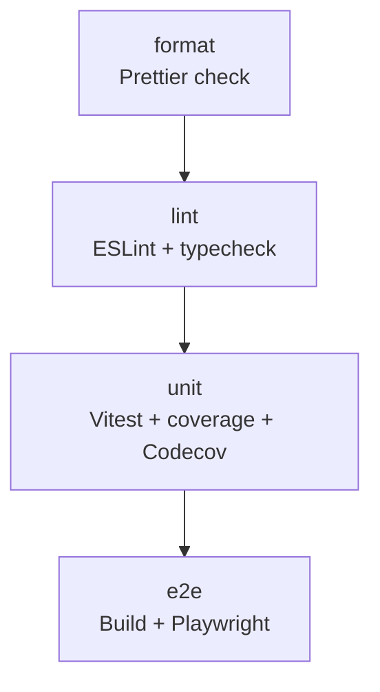

# poc-gh-actions


[](https://codecov.io/gh/miguelpadin/poc-gh-actions)

A Vue 3 + Vite project built specifically to explore and test GitHub Actions workflows (CI, tests, coverage, and automation).  
The repository is intentionally simple to keep the focus on the DevOps pipeline, tooling, and quality controls.

---

## 🎯 Purpose

This repository is intentionally minimal.
Its goal is to showcase a clean, modular CI/CD setup using GitHub Actions, quality gates, automated testing, and release workflows.

---

## 🏗️ CI Pipeline Overview



---

## 🛡️ Quality Gates

The CI pipeline enforces several quality gates:

- Prettier formatting must pass

- ESLint strict mode allows zero warnings

- TypeScript must compile without errors (tsc --noEmit)

- Unit tests must pass with V8 coverage enabled

- E2E tests must succeed in a headless CI environment

- Coverage is uploaded to Codecov (Clover reporter)

Any failure stops the pipeline immediately.

---

## 🚀 Release Workflow

This repository includes a release pipeline triggered by semantic version tags (v*.*.\*).
When a tag is pushed:

- A GitHub Release is generated

- Release notes are automatically created

The workflow can also be triggered manually via workflow_dispatch

---

## 📁 Project Structure

```Python
/
├─ .github/             # GitHub Actions workflows and related config
├─ .husky/              # Husky Git hooks
├─ coverage/            # Vitest coverage reports (generated)
├─ dist/                # Production build output (generated)
├─ e2e/                 # Playwright end-to-end tests
├─ node_modules/        # Project dependencies (generated)
├─ playwright-report/   # Playwright HTML reports (generated)
├─ public/              # Static assets served by Vite
├─ src/                 # Application source code
└─ test-results/        # Test result artifacts (generated)
```

---

## ✅ Features

- **Vue 3 + Vite 7** development environment
- **TypeScript** using the recommended Vue configuration
- **Vitest 4** unit testing with **V8 coverage** (HTML + Clover)
- **Playwright** end-to-end testing (CI headless + local headed mode)
- **ESLint** with Vue, TypeScript, and strict rules
- **Prettier** for consistent formatting (local + CI check)
- **Husky (v9)** Git hooks:
  - **pre-commit**: Prettier check, ESLint check, and Vitest non-interactive tests
  - **pre-push**: Playwright E2E tests before pushing
- **TypeScript type checking** via `tsc --noEmit`
- **GitHub Actions CI** running:
  - Node 20
  - install → format → lint → typecheck → unit tests → coverage upload → E2E tests
- **Codecov** integration (Clover reporter)
- **Deterministic installs** via `npm ci`

---

## ⚙️ Scripts

```bash
npm run dev             # Start Vite dev server
npm run build           # Build the application (vue-tsc + vite build)
npm run preview         # Preview the production build

npm run format:fix      # Apply Prettier formatting
npm run format:ci       # Prettier check (used in CI and pre-commit)

npm run lint:fix        # ESLint with autofix
npm run lint:ci         # ESLint strict mode (no warnings allowed)

npm run typecheck       # TypeScript type checking (tsc --noEmit)
npm run typecheck:build # Legacy script: used a separate tsconfig.build.json for library-style builds; not needed in this Vite app

npm run test:run        # Unit tests (Vitest) in non-interactive mode
npm run test:watch      # Unit tests in watch mode
npm run test:coverage   # Unit tests with coverage (V8, HTML + clover)

npm run test:e2e        # Playwright end-to-end tests (headless, CI-safe)
npm run test:e2e:headed # Playwright in headed mode for debugging

npm run prepreview:test # Build the app before preview:test (Vite production build)
npm run preview:test    # Preview the built app for E2E tests (auto-builds before serving)

npm run prepare         # Install Husky Git hooks (runs automatically after npm install)
```

---

## 🧪 Reproducing CI Locally

```bash
npm ci
npm run format:ci
npm run lint:ci
npm run typecheck
npm run test:coverage
npm run test:e2e
```

---

## 📄 License

MIT License.
Free to use, modify, and distribute.
